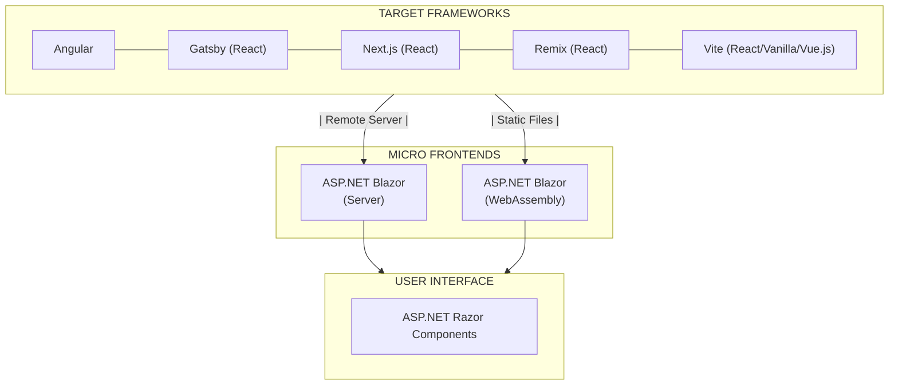

```mermaid
graph TD
FRAMEWORK_ANGULAR["Angular"]
FRAMEWORK_GATSBY["Gatsby (React)"]
FRAMEWORK_NEXTJS["Next.js (React)"]
FRAMEWORK_REMIX["Remix (React)"]
FRAMEWORK_VITE["Vite (React/Vanilla/Vue.js)"]

BLAZOR_MICRO_FRONTENDS_SERVER["ASP.NET Blazor</br>(Server)"]
BLAZOR_MICRO_FRONTENDS_WASM["ASP.NET Blazor</br>(WebAssembly)"]
BLAZOR_RAZOR_COMPONENTS["ASP.NET Razor Components"]

subgraph LAYER_FRAMEWORKS["TARGET FRAMEWORKS"]
    FRAMEWORK_ANGULAR
    FRAMEWORK_GATSBY
    FRAMEWORK_NEXTJS
    FRAMEWORK_REMIX
    FRAMEWORK_VITE

    FRAMEWORK_ANGULAR---FRAMEWORK_GATSBY---FRAMEWORK_NEXTJS---FRAMEWORK_REMIX---FRAMEWORK_VITE
end
subgraph LAYER_MICRO_FRONTENDS["MICRO FRONTENDS"]
    BLAZOR_MICRO_FRONTENDS_WASM
    BLAZOR_MICRO_FRONTENDS_SERVER
end
subgraph LAYER_UI["USER INTERFACE"]
    BLAZOR_RAZOR_COMPONENTS
end

LAYER_FRAMEWORKS-->|"| Remote Server |"|BLAZOR_MICRO_FRONTENDS_SERVER
LAYER_FRAMEWORKS-->|"| Static Files |"|BLAZOR_MICRO_FRONTENDS_WASM
BLAZOR_MICRO_FRONTENDS_SERVER-->LAYER_UI
BLAZOR_MICRO_FRONTENDS_WASM-->LAYER_UI
```